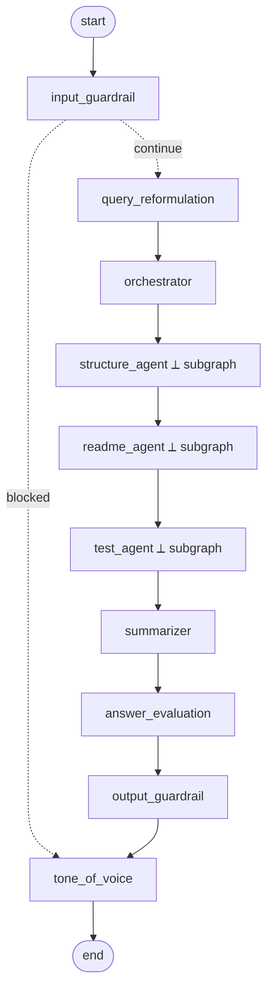

# RepoRadar 🛰️

**A multi-agent system that reviews a GitHub repository — live.**

Give it a public GitHub repo URL (and an optional question). Three specialist agents — orchestrated with **LangGraph** — connect to the **GitHub MCP server** and answer three questions:

1. Does the code have a clean, sensible **structure**?
2. Is the **README** clear and concise?
3. Are **unit tests** written?

You get three verdicts with evidence, a friendly natural-language summary, and a 1–5 quality score — streamed step-by-step to a live UI.

> Built for the **Agentic AI Builder Expert Bootcamp — Batch 4.0**.

---

## What makes it interesting (the teaching points)

- **Multi-graph architecture** — one main LangGraph plus **one subgraph per agent**. You can open every subgraph in LangGraph Studio.
- **GitHub MCP as the only door to GitHub** — agents never call the GitHub API directly. They use read-only tools loaded through `langchain-mcp-adapters`.
- **Guardrails everywhere** — an input guardrail on the way in, an execution guardrail as the *first node of every agent*, and an output guardrail before the answer is finalised.
- **Cost-aware model routing** — a cheap, fast model for guard/format nodes; a strong model for reasoning.
- **Live SSE streaming** — every node start/finish is streamed to the UI so the pipeline reads like a story.

---

## Architecture



**Every agent subgraph** has the same shape — and the execution guardrail always runs first:

```
START → execution_guardrail → tool_selection → tool_execution → analyze → END
        (FIRST node)          (LLM picks       (calls GitHub    (verdict +
                               MCP tools)        MCP tools)       reasons + evidence)
```

The three agents run **sequentially** for a clean, readable Studio diagram. One commented line in `agent/graph.py` shows how to fan them out in parallel.

---

## Project layout

```
reporadar/
  agent/
    config.py            # env + model names (read lazily — imports never need secrets)
    state.py             # ReviewState (shared across graph + subgraphs)
    llm.py               # get_fast_llm() / get_smart_llm()
    mcp_client.py        # GitHub MCP client + cached tool loading
    prompts.py           # ALL system prompts, named and short
    guardrails.py        # input / execution / output guardrails
    nodes.py             # reformulation, orchestrator, summarizer, evaluation, tone
    agents/
      _common.py         # the shared agent-subgraph machinery
      structure_agent.py # subgraph
      readme_agent.py    # subgraph
      test_agent.py      # subgraph
    graph.py             # main graph; exports `graph`
  api/main.py            # FastAPI: /health + /review (SSE streaming)
  frontend/              # React + Vite UI (live progress + report card)
  docs/                  # five beginner-friendly deployment guides
  langgraph.json         # for `langgraph dev` / Studio
  Dockerfile             # multi-stage, slim, non-root
  railway.toml           # Railway deploy config
  requirements.txt
  .env.example
```

---

## Prerequisites

- **Python 3.11+**
- **Node.js 18+** (for the frontend)
- An **OpenAI API key**
- A **GitHub personal access token** (read-only is enough)
- *(Optional)* Docker Desktop, for the container run mode

---

## Setup

**Option A — standard `venv` + `pip`:**

```bash
# 1. From the reporadar/ folder, create a virtual environment (this one includes pip)
python -m venv .venv && source .venv/bin/activate    # Windows: .venv\Scripts\activate

# 2. Install the Python dependencies
pip install -r requirements.txt
```

**Option B — if you use [uv](https://docs.astral.sh/uv/):**

```bash
uv venv && source .venv/bin/activate
uv pip install -r requirements.txt
```

> **Heads-up:** a venv created with `uv venv` does **not** contain its own `pip`. If you run plain `pip install` inside it you'll get `error: externally-managed-environment` (pip falls back to the system Python). Use `uv pip install` instead — or create the venv with `python -m venv`, which does include pip.

**Then create your `.env`:**

```bash
cp .env.example .env   # then paste in your OPENAI_API_KEY and GITHUB_TOKEN
```

Your `.env`:

```env
OPENAI_API_KEY=sk-...
GITHUB_TOKEN=ghp_...
FAST_MODEL=gpt-4o-mini
SMART_MODEL=gpt-4o
GITHUB_MCP_URL=https://api.githubcopilot.com/mcp/
GITHUB_MCP_TRANSPORT=streamable_http
```

> **GitHub MCP — remote vs local.** By default RepoRadar talks to the **remote** GitHub MCP server over HTTP. To run the official server **locally with Docker** instead, set `GITHUB_MCP_TRANSPORT=stdio` (the client then launches `ghcr.io/github/github-mcp-server` over stdio). See `agent/mcp_client.py`.

---

## Run mode 1 — Architecture demo (LangGraph Studio)

Best for teaching the design.

```bash
langgraph dev
```

_What this does:_ starts a local LangGraph server and opens **LangGraph Studio**, where you can see the main graph, expand each of the three agent subgraphs, and run a test review.

---

## Run mode 2 — Product demo (UI)

Two terminals.

**Terminal 1 — the API:**

```bash
uvicorn api.main:app --reload
```

_What this does:_ serves the FastAPI backend on `http://localhost:8000` (`/health` and the streaming `/review` endpoint).

**Terminal 2 — the frontend:**

```bash
cd frontend
npm install
npm run dev
```

_What this does:_ starts the Vite dev server on `http://localhost:5173` and proxies API calls to the backend. Open it, paste a repo URL, and watch the scan run live.

---

## How a review flows

1. **input_guardrail** — is this a valid GitHub repo URL, on-topic, and safe? (If not → polite refusal.)
2. **query_reformulation** — clean up the request and extract the repo URL.
3. **orchestrator** — choose which agents to run (default: all three).
4. **structure / readme / test agents** — each runs its `execution_guardrail → tool_selection → tool_execution → analyze` pipeline against the GitHub MCP tools.
5. **summarizer** — merge the findings into one coherent summary.
6. **answer_evaluation** — an LLM judge scores the review 1–5.
7. **output_guardrail** — is the report grounded in the findings, with no leaked secrets?
8. **tone_of_voice** — polish into a friendly, professional answer.

---

## Deploying

Beginner-friendly, step-by-step guides live in [`docs/`](docs/):

| Guide | What it covers |
| --- | --- |
| [01 · Push to GitHub](docs/01_push_to_github.md) | git init, first commit, create the repo, push |
| [02 · Deploy to Railway](docs/02_deploy_to_railway.md) | Dashboard **and** CLI, env vars, domain, `/health` |
| [03 · Deploy with Docker](docs/03_deploy_with_docker.md) | the multi-stage image, build, run, logs, Docker Hub |
| [04 · Deploy to Azure](docs/04_deploy_to_azure_future.md) | *future/optional* — Container Apps (region `southeastasia`) |
| [05 · Deploy to AWS](docs/05_deploy_to_aws_future.md) | *future/optional* — ECS Fargate via Copilot (region `ap-southeast-1`) |

The quickest container check:

```bash
docker build -t reporadar .
docker run -p 8000:8000 --env-file .env reporadar
```

_What this does:_ builds the image (UI + API) and runs it; open `http://localhost:8000`.

---

## Tech stack

LangGraph · LangChain-OpenAI · langchain-mcp-adapters (GitHub MCP) · FastAPI · sse-starlette · React + Vite · Docker · Railway.

---

*Agentic AI Builder Expert Bootcamp — Batch 4.0*
